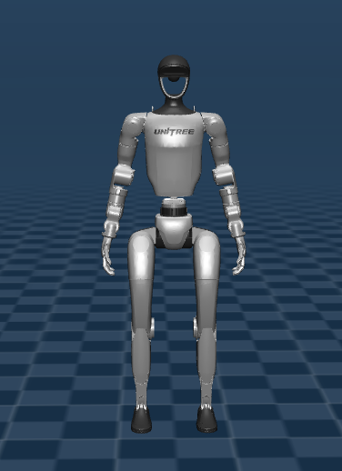
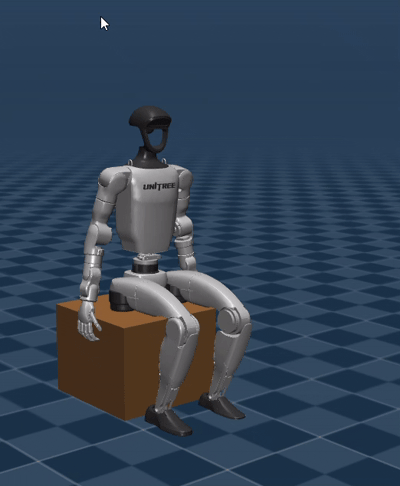

# Unitree G1: Whole-Body Control for Balancing and Sit-to-Stand

This repository contains the implementation of a Whole-Body Controller (WBC) based on Quadratic Programming (QP) for the Unitree G1 humanoid robot. The framework utilizes MuJoCo for simulating physics and kinematics, focusing on fundamental humanoid tasks: balancing under gravity and transitioning from a seated position to standing.

## Table of Contents
- [Overview](#overview)
- [Project Structure](#project-structure)
- [Mathematical Formulation](#mathematical-formulation)
  - [Rigid Body Dynamics](#rigid-body-dynamics)
  - [Quadratic Program (QP) Objective](#quadratic-program-qp-objective)
  - [Constraints](#constraints)
- [Simulation Results](#simulation-results)
  - [Balancing](#balancing)
  - [Sit-to-Stand](#sit-to-stand)
- [Usage](#usage)

## Overview

The Whole-Body Controller operates at 500Hz, computing joint torques by solving a constrained optimization problem. It ensures tracking of task space commands (like the Center of Mass (CoM) position) and joint space commands (posture), while strictly adhering to hardware limitations and contact stability constraints.

## Project Structure

- **`g1_balancing/`**: Contains the WBC setup and testing script (`test_wbc_stand.py`) for static standing balance. The robot is initialized in a nominal stance and must resist gravity and maintain its CoM above the support polygon.
- **`g1_sit_to_stand/`**: Contains the trajectory generation and WBC execution (`test_wbc_sit_to_stand.py`) for the sit-to-stand task. It initially follows a kinematic trajectory using PD control (Mink-IK) and transitions to the WBC for final stabilization once standing.

## Mathematical Formulation

The WBC is cast as a Quadratic Program (QP) with decision variables $x = \begin{bmatrix} \ddot{q}^T & \tau^T & F^T \end{bmatrix}^T$, representing the joint accelerations, joint torques, and contact forces, respectively.

### Rigid Body Dynamics

The fundamental equality constraint is the rigid body dynamics equation:

$$ M(q)\ddot{q} + h(q, \dot{q}) = S^T\tau + J_c(q)^TF $$

where:
- $M(q) \in \mathbb{R}^{n_v \times n_v}$ is the mass matrix.
- $h(q, \dot{q}) \in \mathbb{R}^{n_v}$ represents the Coriolis, centrifugal, and gravity forces.
- $S \in \mathbb{R}^{n_u \times n_v}$ is the actuation selection matrix.
- $J_c(q)$ is the contact Jacobian mapping contact forces $F$ to generalized forces.

### Quadratic Program (QP) Objective

The objective function minimizes the weighted sum of squared task errors and regularization terms:

$$ \min_{x} \sum_{i} w_i \| J_i \ddot{q} + \dot{J}_i \dot{q} - \ddot{x}_{i}^{des} \|_2^2 + w_{\tau} \|\tau\|_2^2 + w_{F} \|F - F_{ref}\|_2^2 + w_{\ddot{q}} \|\ddot{q}\|_2^2 $$

**Tasks:**
1. **CoM Tracking**: Regulates the Center of Mass position and velocity.
   $$ \ddot{x}_{com}^{des} = K_{p,com} (x_{com}^{des} - x_{com}) + K_{d,com} (0 - \dot{x}_{com}) $$
2. **Posture Tracking**: Maintains the desired joint configuration.
   $$ \ddot{q}_{posture}^{des} = K_{p,q} (q_{des} - q) + K_{d,q} (0 - \dot{q}) $$
3. **Foot Contacts**: Ensures the feet remain stationary on the ground (zero acceleration).
   $$ J_{foot}\ddot{q} + \dot{J}_{foot}\dot{q} = 0 $$

### Constraints

The solver operates subject to physical and environmental constraints:

1. **Torque Limits**:
   $$ \tau_{min} \le \tau \le \tau_{max} $$
2. **Friction Cone (Coulomb Friction)**:
   $$ F_z \ge 0 \quad \text{and} \quad F_z \le F_{z,max} $$
   $$ -\mu F_z \le F_x \le \mu F_z $$
   $$ -\mu F_z \le F_y \le \mu F_z $$
3. **Kinematic Limits**:
   $$ -\ddot{q}_{max} \le \ddot{q} \le \ddot{q}_{max} $$

## Simulation Results

### Balancing
In the static balancing task, the robot successfully initializes from a standing pose and uses the WBC to distribute forces across both feet while maintaining its CoM perfectly centered.



### Sit-to-Stand
The sit-to-stand motion involves a 4.5s kinematic trajectory phase where the robot shifts its weight forward and stands up, after which the WBC activates to stabilize the final posture. 



**Sit-to-Stand Trajectory Stats (500Hz):**
- Total steps: 2251 (4.5s)
- CoM X-shift during rise: -0.031m to 0.217m
- Pelvis Z height change: 0.477m to 0.760m
- Transition to WBC: Smooth handover at t=4.5s with zero initial positional error.

## Usage

**Requirements:**
- Python 3.10+
- `mujoco`, `numpy`, `osqp`

**Run Balancing:**
```bash
python g1_balancing/test_wbc_stand.py
```

**Run Sit-to-Stand:**
```bash
python g1_sit_to_stand/test_wbc_sit_to_stand.py
```

You can interact with the MuJoCo viewer during simulation. Press `Space` to pause/resume, and `R` to reset the simulation to the initial state.
